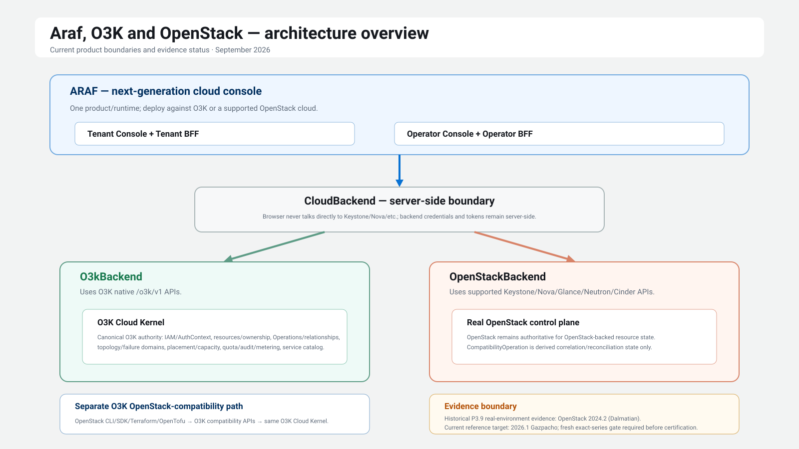
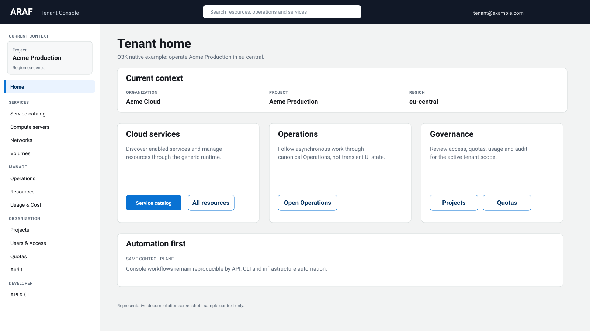
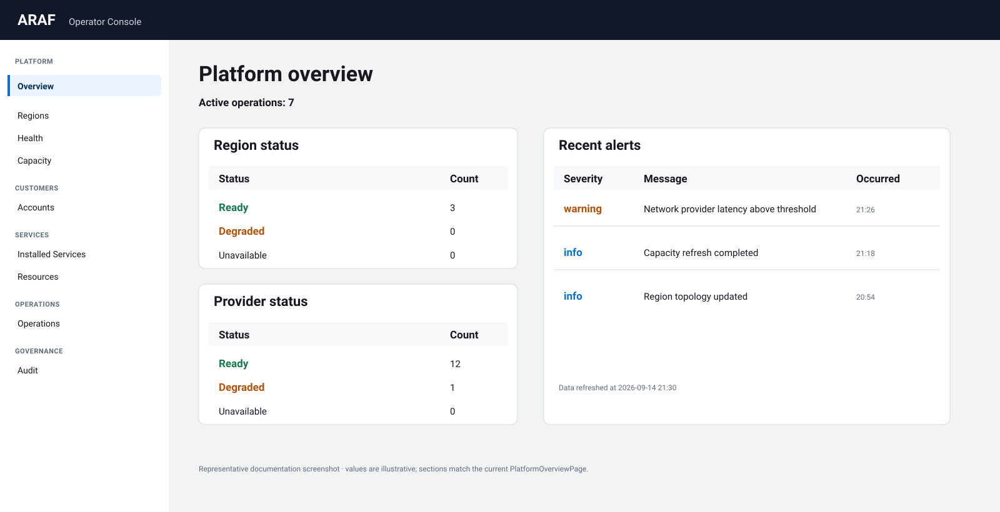

# Araf

**A next-generation cloud console for O3K and supported OpenStack clouds.**

Araf is one tenant/operator console product with a shared generic UX and a server-side `CloudBackend` boundary. [O3K](https://github.com/o3kio/o3k) is Araf's native semantic model and richest integration; supported OpenStack clouds are operated through a bounded `OpenStackBackend` without turning Nova, Neutron, Cinder, or Glance into the normal tenant mental model.

Araf is **not** a Horizon fork and does not implement a Horizon compatibility protocol. It is intended as a modern successor to Horizon's role for the supported OpenStack profile while remaining the native console for O3K. Each backend remains authoritative for its own cloud resource state.



For the full architecture, authority boundaries, compatibility paths, current support evidence, and claim limits, see [Araf, O3K and OpenStack architecture](docs/architecture/araf-o3k-openstack.md).

For the product surfaces grounded in the current implementation, see the [Araf visual tour](docs/product/visual-tour.md).

## Product preview

The following are **documentation renderings based on the current implemented screen structure**. Sample names, counts, statuses and timestamps are illustrative; they are not live cloud telemetry.

### Tenant Console



### Operator Console



## Strategic position

Araf must support the same product architecture across:

- enterprise private cloud,
- sovereign/regional cloud,
- service-provider/MSP deployments,
- community and development environments.

The product may expose different capabilities per deployment, but it must not fork into separate product-specific dashboards.

## Frozen direction

- Shared UI platform with **separate Tenant Console and Operator Console security/deployment surfaces**.
- React + TypeScript + Vite frontend.
- O3K-owned design-system API, initially implemented using Cloudscape-compatible primitives.
- Rust Backend-for-Frontend (BFF) services; browser code does not own raw O3K or OpenStack backend credentials/tokens.
- O3K-native semantics remain the primary model; supported OpenStack clouds sit behind the server-side `CloudBackend` boundary and do not redefine the normal tenant UX vocabulary.
- Manifest-first, capability-driven generic resource runtime.
- Durable O3K Operations are first-class UX objects; OpenStack `CompatibilityOperation` state is derived correlation/reconciliation state and never overrides authoritative OpenStack resource truth.
- Portal/API/CLI/Terraform parity; no privileged console-only cloud semantics.
- Provider details are visible to operators when required and hidden from ordinary tenants.
- WCAG 2.2 AA target for production-critical workflows.

## Development

### Toolchains (pinned)

- **Node.js 22 LTS** (`.nvmrc`: 22.23.2, `engines` range `>=22.12.0 <23`)
- **pnpm 10.14.0** (`packageManager` field, enabled via `corepack enable`)
- **Rust 1.95.0** (`rust-toolchain.toml`, with `rustfmt` and `clippy`)

### Layout

- `apps/tenant-console`, `apps/operator-console` — separate React/Vite surfaces (ADR 0001)
- `packages/*` — shared UI/runtime platform; `@araf/ui` is the only package allowed to import an underlying component library (ADR 0004)
- `backend/*` — Rust BFF workspace (`console-bff-core`, `tenant-bff`, `operator-bff`)

### Commands

```bash
corepack enable
pnpm install

pnpm format:check   # prettier --check
pnpm lint           # eslint (type-aware, strict)
pnpm typecheck      # tsc project builds
pnpm test           # vitest unit/component tests
pnpm build          # production builds of both consoles

cd backend
cargo fmt --all -- --check
cargo clippy --workspace --all-targets --all-features -- -D warnings
cargo check --workspace --all-targets --all-features
cargo test --workspace --all-features
```

Run locally:

```bash
pnpm --filter @araf/tenant-console dev     # http://localhost:5173
pnpm --filter @araf/operator-console dev   # http://localhost:5174
cargo run -p tenant-bff                    # http://localhost:8080/healthz
cargo run -p operator-bff                  # http://localhost:8081/healthz
```

## Planning status

The repository planning pack defines two delivery gates:

1. **Prototype gate** — prove the shared design system, separate shells, generic resource runtime, schema-driven actions and Operation UX using contract fixtures.
2. **MVP gate** — connect the architecture to real supported O3K native APIs, add production authentication/session boundaries, tenant/operator workflows, service discovery, usage visibility, security hardening and release gates.

Live tracking starts at **epic #2**; the committed roadmap index is in `issues/README.md`.

See:

- `docs/operator/README.md` — cold-operator installation, support and recovery entry point.
- `docs/product/mvp-prototype.md`
- `docs/product/strategic-alignment.md`
- `docs/product/screen-inventory.md`
- `docs/product/visual-tour.md`
- `docs/architecture/araf-o3k-openstack.md`
- `docs/architecture/overview.md`
- `docs/architecture/backend-abstraction.md`
- `docs/architecture/o3k-integration-contract.md`
- `docs/production/openstack-support.md`
- `docs/engineering/openstack-production-evidence.md`
- `docs/security/threat-model.md`
- `docs/engineering/quality-gates.md`
- `docs/roadmap.md`
- `issues/README.md`
- `prompts/README.md`

## Non-goals for the first MVP

The first MVP does **not** include full billing/invoicing, marketplace execution, arbitrary third-party JavaScript plugins, OpenStack migration-center implementation, Kubernetes/database product UX, graphical VM console, AI-driven control-plane actions, native mobile applications, or a complete white-label reseller hierarchy.

These are future-compatible requirements, not MVP deliverables.

## License

Apache License 2.0. See `LICENSE` in the repository root.
