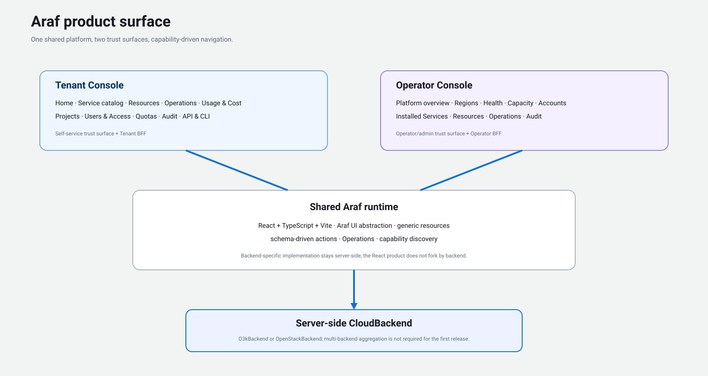
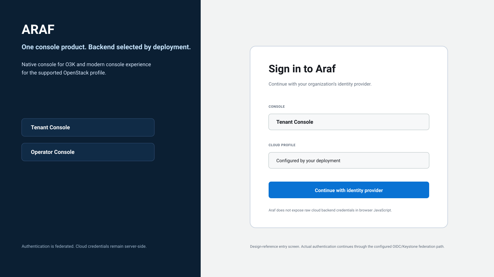
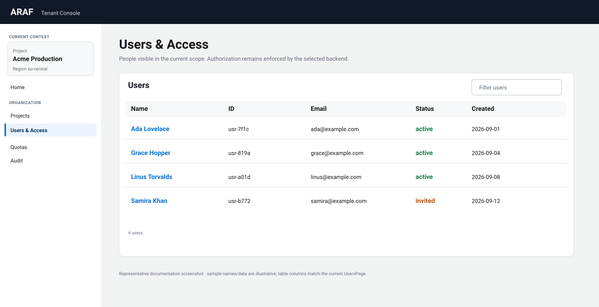
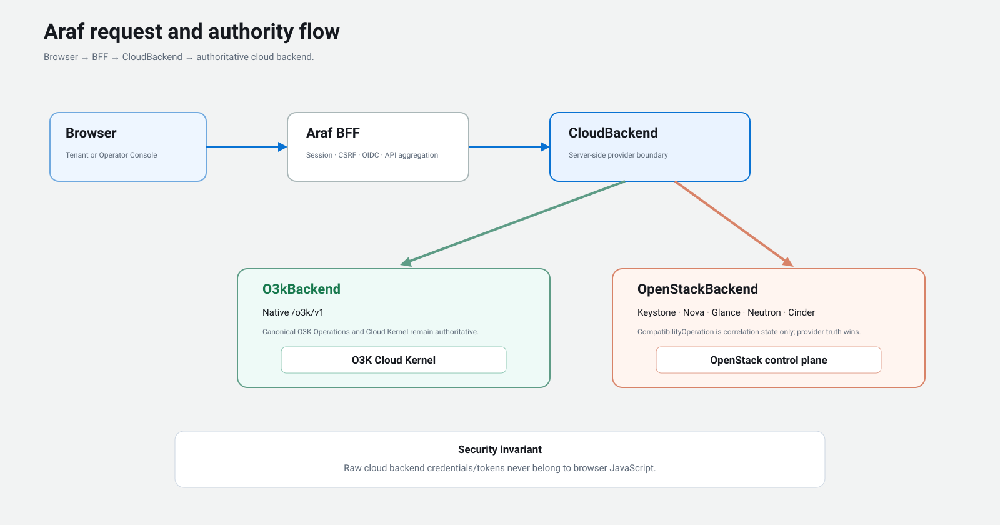

# Araf visual tour

These images are **documentation renderings grounded in the current Araf screen inventory and implementation**. They are not live telemetry captures. Sample project, user, status, count, and timestamp values are intentionally illustrative so documentation never presents invented data as observed cloud state.

The shell structure, navigation names, table columns, page sections, trust boundaries, and backend model are taken from the current Araf implementation and architecture.

## Product surface



Araf is one shared React product/runtime with separate Tenant and Operator security surfaces. Backend-specific behavior stays behind the server-side `CloudBackend` boundary rather than creating O3K-specific and OpenStack-specific React applications.

## Sign-in boundary



This image is a **design-reference entry screen**, not a claim that Araf currently owns a password login form. Authentication continues through the configured Tenant/Operator BFF and OIDC/Keystone federation path. Raw O3K/OpenStack backend credentials and tokens remain server-side.

A deployment selects the backend profile; this screen does not imply that one running Araf instance aggregates multiple clouds.

## Tenant home


This is an O3K-native example of the current Tenant Home structure. It follows the implemented navigation and `HomePage` layout:

- permanent project/region context;
- Service Catalog and resource entry points;
- Operations;
- governance entry points;
- API/CLI automation parity.

The Acme names and region shown in the rendering are sample documentation data only.

## Users & Access



The table structure matches the current `UsersPage`: **Name, ID, Email, Status, Created**. Capability checks and backend authorization remain authoritative; Araf does not infer permission from what is merely visible in the UI.

All people, IDs, emails, dates, and statuses in the image are illustrative.

## Operator overview


The rendering follows the current `PlatformOverviewPage` structure:

- active operations;
- region status;
- provider status;
- recent alerts;
- data-freshness indication.

Counts, alerts, and timestamps are illustrative and must not be read as live O3K or OpenStack telemetry.

## Request and authority flow



The central invariant is:

```text
browser
  -> Tenant/Operator BFF
    -> CloudBackend
      -> O3kBackend -> authoritative O3K
      -> OpenStackBackend -> authoritative OpenStack
```

O3K canonical Operations remain authoritative on O3K. OpenStack `CompatibilityOperation` records are correlation/reconciliation state and never replace authoritative OpenStack resource state.

## Source references

The visual tour is intentionally tied to current source rather than a separate speculative design system:

- `apps/tenant-console/src/App.tsx`
- `apps/tenant-console/src/HomePage.tsx`
- `apps/operator-console/src/App.tsx`
- `packages/governance/src/pages/UsersPage.tsx`
- `packages/operator-platform/src/pages/PlatformOverviewPage.tsx`
- `packages/shell/src/shell.css`
- `packages/ui/src/tokens.css`
- `docs/product/screen-inventory.md`
- `docs/architecture/araf-o3k-openstack.md`
